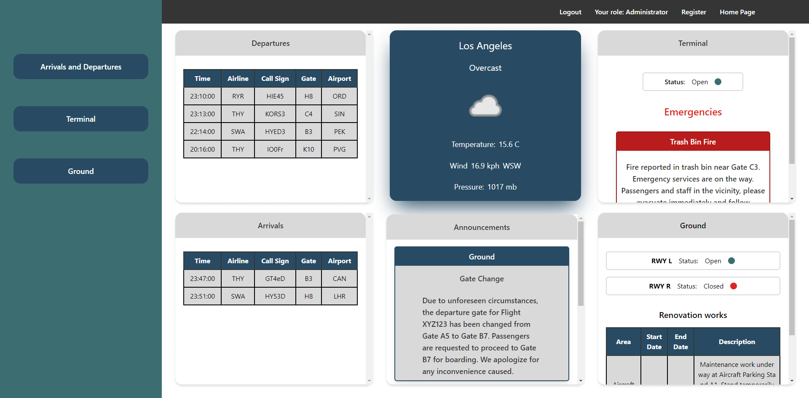
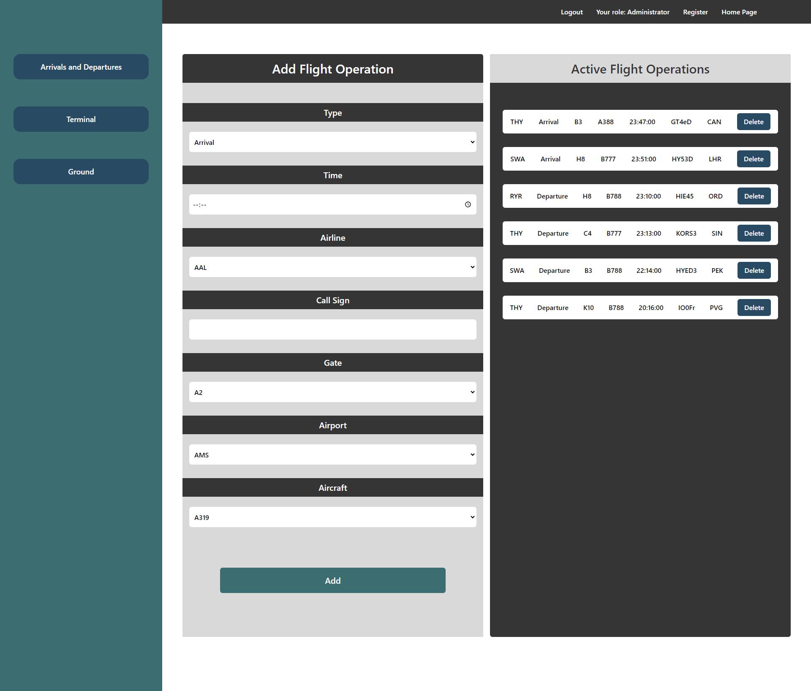
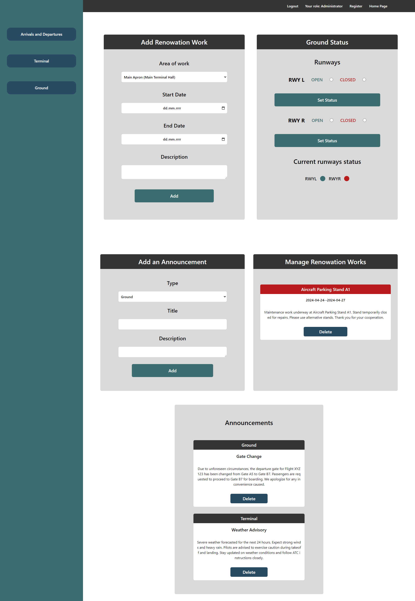
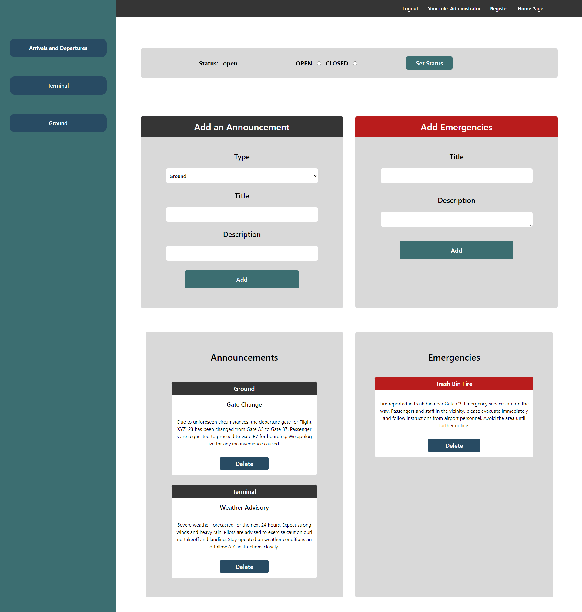
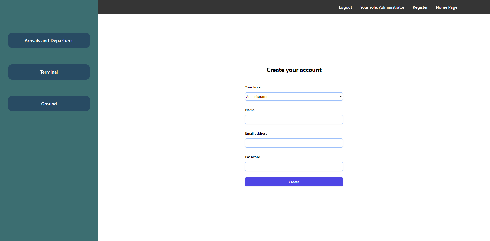

## Functions in the Project

### Flight Operations
- Adding arrivals and departures.
- Managing airport operations.

### User Role-Controlled Data Editing
- Access to edit data in the system controlled by user role.

### Runway Availability Management
- Managing the availability of runways.

### Access Roles:
1. **Administrator**
   - Full access to all functions.
   
2. **Flight Operations Manager**
   - Access to edit flight operations.
   
3. **Terminal Manager**
   - Access to manage announcements and emergency situations.
   
4. **Airport Ground Manager**
   - Access to manage maintenance works, ground announcements, and runway statuses.

# Screenshots

## Dashboard

## Flight Operations Manager

## Airport Ground Manager

## Terminal Manager

## Register

Installation Instructions
-------------------------

### Prerequisites

*   XAMPP installed on your system.
    
*   [Composer](https://getcomposer.org/) installed on your system.
    
    
### Steps to Install

1. git clone https://github.com/yourusername/project-name.gitReplace **yourusername** and **project-name** with your actual GitHub username and project name.
    
2.  cd project-name
    
3.  composer install
    
4.  cp .env.example .env
    
5.  php artisan key:generate
    
6.  **Configure Database:**
    
    *   Open **.env** file and configure your database settings (database name, username, password).
        
7.  php artisan migrate
    
8.  npm install
    
9.  npm run devFor production:bashCopy codenpm run production
    
10.  php artisan serve
    
11.  **Access Your Application:**Open your web browser and go to **http://localhost:8000** to view your Laravel React application.
    

### Additional Notes

*   Make sure XAMPP is running before starting the Laravel server.
    
*   You may need to configure XAMPP's Apache settings to serve your Laravel application properly.
